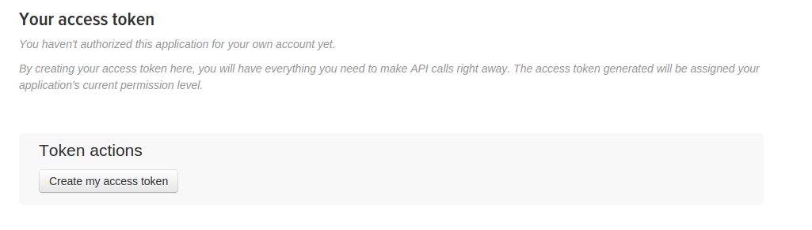

Getting a bot running on Twitter can be a little tricky. Twitter uses
a something called [OAuth](https://dev.twitter.com/oauth) to validate
requests, but it's a little more complicated than just specifying a
username/password.

* Login to Twitter with your bot account

* Go to https://apps.twitter.com/app/new

* Fill out the form. You need to put a name, description, and Website
  URL, although the URL doesn't need to exist. 
  

* Save the form, and then click on the Permissions tab. You will need
  to specify what level of access is needed for your bot.  You have three
  choices here: Read only, Read and Write, and Read and Write and
  access DMs. If your bot isn't actually ever going to post to Twitter
  (for example, if you're just running a search to find interesting
  tweets), you can choose read-only. Otherwise, you should pick
  read/write, or read/write/DMs. Chatterbot has limited support for
  handling Direct Messages, but if you can imagine a situation where
  you might want to handle them, you should pick this option.

* *NOTE:* When you try and save this form, there's a good chance that
  you will get an error that tells you to add a mobile phone to your Twitter
  profile. It will look a lot like this: 

  You can add your number here: https://twitter.com/settings/devices

  After you add the number, Twitter will ask you to send them a text
  message. Once you do this, you can finish updating the settings for
  your application. Later, we'll remove the mobile number.


Once you've registered your application, you have two options. You can
create access tokens for your bot via Twitter, or you can run the
`chatterbot-register` script. Running the script will take care of
creating a template file for your bot, but if you don't want to do
that, here are the steps for doing this manually:
  
*  click the 'Keys and Access Tokens' link. You should see this: 
* click the 'Create my access token' link. 
* It might take a few minutes for Twitter to actually generate the
  token. You can refresh the page a couple times until they are there,
  then you can copy the keys into your application. There's four keys
  you will need for your bot, and a couple different ways to save
  them:

**In a separate YAML config file**. Create a file named botname.yaml
  -- the botname part must match your bot's username EXACTLY. Put the
  following contents, pasting the credential values that you just
  generated:

```
  ---
  :consumer_secret: Consumer Secret (API Secret) GOES HERE
  :consumer_key: Consumer Key (API Key) GOES HERE
  :token: Access Token GOES HERE
  :secret: Access Token Secret GOES HERE
```

**in the script**. Add some lines to your bot script like this:
```
consumer_key 'Consumer Secret (API Secret)'
consumer_secret 'Consumer Key (API Key)'
secret 'Access Token Secret'
token 'Access Token'
```

**in a database**. If you've setup chatterbot to use a database, you
  can store your configuration info in the **config** table.


**NOTE** At this point, you can remove the phone number from the bot
  account if you like. From your bot's account, click 'Settings' ->
  'Mobile' -> 'Delete my phone'.
